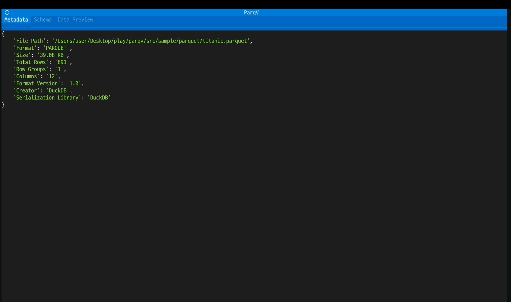

# parqv

[](https://www.python.org/)
[](LICENSE)
[](https://badge.fury.io/py/parqv) <!-- TODO: Link after first PyPI release -->
[](https://textual.textualize.io/)

---

**Supported File Formats:** ✅ **Parquet** | ✅ **JSON** / **JSON Lines (ndjson)** | ✅ **CSV / TSV** | *(More planned!)*

---

**`parqv` is a Python-based interactive TUI (Text User Interface) tool designed to explore, analyze, and understand various data file formats directly within your terminal.** `parqv` aims to provide a unified, visual experience for quick data inspection without leaving your console.

## 💻 Demo


*(Demo shows Parquet features; UI adapts for other formats)*

## 🤔 Why `parqv`?
1.  **Unified Interface:** Launch `parqv <your_data_file>` to access **metadata, schema, data preview, and column statistics** all within a single, navigable terminal window. No more juggling different commands for different file types.
2.  **Interactive Exploration:**
    *   **🖱️ Keyboard & Mouse Driven:** Navigate using familiar keys (arrows, `hjkl`, Tab) or even your mouse (thanks to `Textual`).
    *   **📜 Scrollable Views:** Easily scroll through large schemas, data tables, or column lists.
    *   **🌲 Clear Schema View:** Understand column names, data types, and nullability at a glance. (Complex nested structures visualization might vary by format).
    *   **📊 Dynamic Stats:** Select a column and instantly see its detailed statistics (counts, nulls, min/max, mean, distinct values, etc.).
3.  **Cross-Format Consistency:**
    *   **🎨 Rich Display:** Leverages `rich` and `Textual` for colorful, readable tables and text across supported formats.
    *   **📈 Quick Stats:** Get key statistical insights consistently, regardless of the underlying file type.
    *   **🔌 Extensible:** Designed with a handler interface to easily add support for more file formats in the future (like CSV, Arrow IPC, etc.).

## ✨ Features (TUI Mode)
*   **Multi-Format Support:** Now supports **Parquet** (`.parquet`), **JSON/JSON Lines** (`.json`, `.ndjson`), and **CSV/TSV** (`.csv`, `.tsv`). Run `parqv <your_file.{parquet,json,ndjson,csv,tsv}>`.
*   **Metadata Panel:** Displays key file information (path, format, size, total rows, column count, etc.). *Fields may vary slightly depending on the file format.*
*   **Schema Explorer:**
    *   Interactive list view of columns.
    *   Clearly shows column names, data types, and nullability.
*   **Data Table Viewer:**
    *   Scrollable table preview of the file's data.
    *   Attempts to preserve data types for better representation.
*   **Column Statistics Viewer:**
    *   Select a column in the Schema tab to view detailed statistics.
    *   Shows counts (total, valid, null), percentages, and type-specific stats (min/max, mean, stddev, distinct counts, length stats, boolean value counts where applicable).
*   **Row Group Inspector (Parquet Specific):**
    *   *This panel only appears when viewing Parquet files.*
    *   Lists row groups with stats (row count, compressed/uncompressed size).
    *   (Planned) Select a row group for more details.

## 🚀 Getting Started

**1. Prerequisites:**
*   **Python:** Version 3.10 or higher.
*   **pip:** The Python package installer.

**2. Install `parqv`:**
*   Open your terminal and run:
    ```bash
    pip install parqv
    ```
    *(This will also install dependencies like `textual`, `pyarrow`, `pandas`, and `duckdb`)*
*   **Updating `parqv`:**
    ```bash
    pip install --upgrade parqv
    ```

**3. Run `parqv`:**
*   Point `parqv` to your data file:
    ```bash
    #parquet
    parqv /path/to/your/data.parquet
    
    # json
    parqv /path/to/your/data.json
*   The interactive TUI will launch. Use your keyboard (and mouse, if supported by your terminal) to navigate:
    *   **Arrow Keys / `j`,`k` (in lists):** Move selection up/down.
    *   **`Tab` / `Shift+Tab`:** Cycle focus between the main tab content and potentially other areas. (Focus handling might evolve).
    *   **`Enter` (in column list):** Select a column to view statistics.
    *   **View Switching:** Use `Ctrl+N` (Next Tab) and `Ctrl+P` (Previous Tab) or click on the tabs (Metadata, Schema, Data Preview).
    *   **Scrolling:** Use `PageUp` / `PageDown` / `Home` / `End` or arrow keys/mouse wheel within scrollable areas (like Schema stats or Data Preview).
    *   **`q` / `Ctrl+C`:** Quit `parqv`.
    *   *(Help Screen `?` is planned)*

---

## 📄 License

Licensed under the Apache License, Version 2.0. See [LICENSE](LICENSE) for the full license text.
